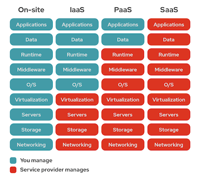

## CLOUD SERVICE MODELS

       
[Reference](https://www.redhat.com/en/topics/cloud-computing/iaas-vs-paas-vs-saas)

### **Infrastructure-as-a-Service (IAAS)**  
Infrastructure As A Service (IAAS) is means of delivering computing infrastructure as on-demand services. It is one of the three fundamental cloud service models. The user purchases servers, software data center space, or network equipment and rent those resources through a fully outsourced, on-demand service model. It allows dynamic scaling and the resources are distributed as a service. It generally includes multiple-user on a single piece of hardware. IaaS products allow organizations to manage their business resources — such as their network, servers, and data storage — on the cloud.  
Examples of IAAS products:  
* Amazon Web Services
* Google Cloud
* Microsoft Azure
* Digital Ocean
* Linode

When are IAAS products used?  
They are used when an increase in scale and performance is required. They are also used for enhanced security, and reduction in the costs of running an application or workload.  
They are used for quick set-up of test and development environments. IaaS makes it quick and economical to scale dev/test environments up and down.  
 
 
### **Platform-as-a-Service (PAAS)**
Platform as a service (PaaS) is a cloud infrastructure layer that provides resources to build user-level tools and applications. It includes the underlying infrastructure including compute, network, and storage resources, as well as development tools, database management systems, and middleware. PaaS products allow businesses and developers to host, build, and deploy consumer-facing apps.  
Example of PAAS products: 
* AWS Elastic Beanstalk 
* Google App Engine
* Red Hat OpenShift
* Microsoft Azure
* Heroku

When are PAAS products used?  
PaaS products are used when flexibility, increased security, cost and time are very important. 

Platform as a service (PaaS) is essentially a layer between infrastructure as a service (IaaS) and software as a service (SaaS). While IaaS provides just the pay-as-you-go infrastructure for a company, PaaS steps it up by also providing a variety of tools needed to create applications.
 
 
### **Software-as-a-Service (SAAS)**
Software As A Service (SAAS) allows users to run existing online applications and it is a model software that is deployed as a hosting service and is accessed over Output Rephrased/Re-written Text the internet or software delivery model during which software and its associated data are hosted centrally and accessed using their client, usually an online browser over the web. SAAS services are used for the development and deployment of modern applications. SaaS products offer both consumers and businesses cloud-based tools and applications for everyday use.  
Example of PAAS products:  
* HubSpot
* JIRA
* Dropbox
* DocuSign
* Trello

When are SAAS products used?  
SAAS products are used to reduce the need of installing and maintaining software. It can be simply accessed via the Internet, removing the task of management of hardware and complex software. 